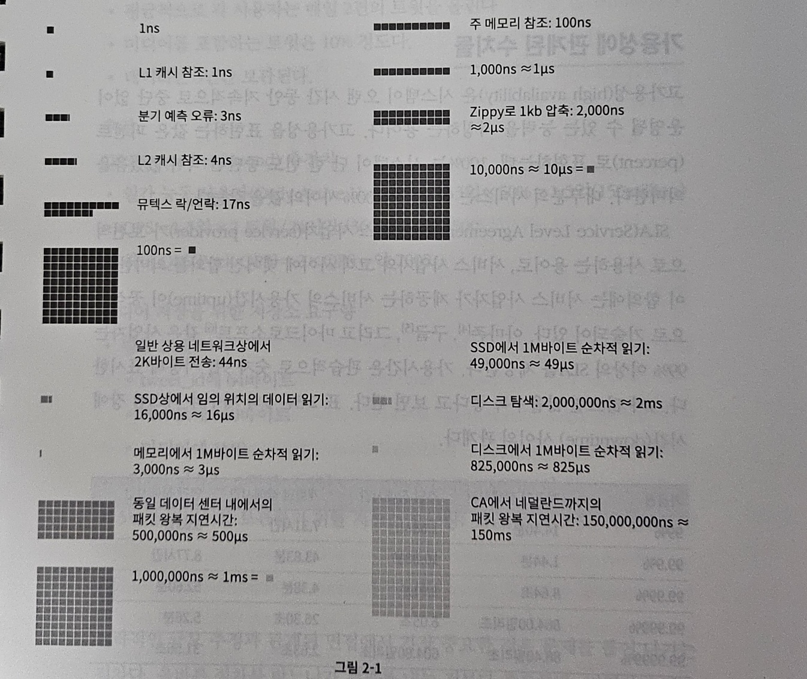

# 2장. 개략적인 규모 측정

## 핵심요약
- 근사치를 활용한 계산.
- 가정을 작성 해 둘 것.
- 단위 붙이는 것을 습관화 할 것.

## (1) 2의 제곱수

1. 최소 단위는 1바이트(8비트)
2. ASCII 문자 하나가 차지하는 메모리 크기가 1바이트

- 흔히 쓰이는 데이터 볼륨 단위

| 2의 제곱 | 근사치   | 이름     | 축약형 |
|-------|-------|--------|-----|
| 10    | 1천    | 1킬로바이트 | 1KB |
| 20    | 1백만   | 1메가바이트 | 1MB |
| 30    | 10억   | 1기가바이트 | 1GB |
| 40    | 1조    | 1테라바이트 | 1TB |
| 50    | 1000조 | 1페타바이트 | 1PB |

- 응답지연 값

| 연산명                                | 시간                    |
|------------------------------------|-----------------------|
| L1 캐시 참조                           | 0.5ns                 |
| 분기 예측 오류(branch mispredict         | 5ns                   |
| L2 캐시 참조                           | 7ns                   |
| 뮤텍스(mutex) 락/언락                    | 100ns                 |
| 주 메모리 참조                           | 100ns                 |
| Zippy로 1KB 압축                      | 10,000ns = 20μs       |
| 1 Gbps 네트워크로 2KB 전송                | 20,000ns = 20μs       |
| 메모리에서 1MB 순차적으로 read               | 250,000ns = 250μs     |
| 같은 데이터 센터 내에서의 메시지 왕복 지연시간         | 500,000ns = 500μs     |
| 디스크 탐색(seek)                       | 10,000,000ns = 10ms   |
| 네트워크에서 1MB 순차적으로 read              | 10,000,000ns = 10ms   |
| 디스크에서 1MB 순차적으로 read               | 30,000,000ns = 30ms   |
| 한 패킷의 CA(캘리포니아)로부터 네덜란드까지의 왕복 지연시간 | 150,000,000ns = 150ms |  |

> ns = 나노초, μs = 마이크로초, ms = 밀리초 
> 1나노초 = 10^-9초 
> 1마이크로초 = 10^-6초 = 1,000나노초 
> 1밀리초 = 10^-3초 = 1,000μs = 1,000,000ns

- 응답 시간의 시각화
  

- 핵심
    - 메모리는 빠르지만 디스크는 느리다.
    - 디스크 탐색은 가능한 피하라.
    - 단순한 압축 알고리즘은 빠르다.
    - 데이터를 인터넷으로 전송하기 전에 가능하면 압축하라.
    - 데이터 센터는 보통 여러 지역에 분산되어 있고, 센터들 간에 데이터를 주고받는 데는 시간이 걸린다.
