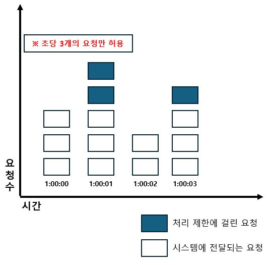
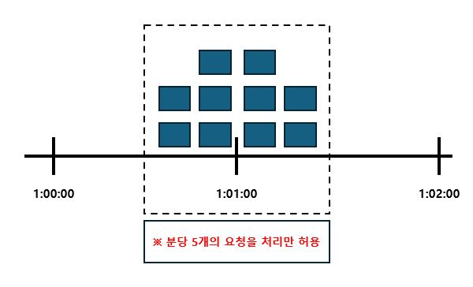

# 4장. 처리율 제한 장치의 설계

## (2) 처리율 제한 알고리즘

### 1. 토큰 버킷(token bucket)
> 장점 :
>   -&nbsp;구현이 쉽다
>   -&nbsp;메모리 사용 측면에서도 효율적이다.
>   -&nbsp;짧은 시간에 집중되는 트래픽도 처리 가능하다.
>   
> 단점 :
>   -&nbsp; 버킷의 크기와 토큰 공급률을 인자로 갖는데 이 두개를 적절히 설정하기가 어렵다.
- 각 요청이 처리될 때마다 하나의 토큰을 사용한다.
- 요청이 도착하면 버킷에 충분한 토큰이 있는지 검사한다.
- 충분한 토큰이 있는 경우, 버킷에서 토큰 하나를 꺼낸 후 요청을 시스템에 전달한다.
- 충분한 토큰이 없는 경우, 해당 요청은 버려진다(dropped).

### 2. 누출 버킷(leaky bucket)
> - 토큰 버킷 알고리즘과 비슷하지만, 요청 처리율이 고정되어 있다는 점이 다르다. 
> - 보통 FIFO(First In First Out) 큐로 구현한다.

> 장점 :
>   -&nbsp;큐의 크기가 제한되어 있어 메모리 사용 측면에서 효율적이다.
>   -&nbsp;고정된 처리율을 갖고 있기 때문에 안정적 출력이 필요한 경우 적합하다.
>   
> 단점 :
>   -&nbsp; 단시간에 많은 트래픽이 몰리는 경우 큐에는 오래된 요청들이 쌓이게되고, 그 요청들이 제때 처리 못하면 최신 요청들이 버려진다.
>   -&nbsp; 두 개 인자를 갖고 있는데, 이들을 올바르게 튜닝하기가 어렵다.

- 요청이 도착하면 큐가 가득 차 있는지 확인한다.
- 빈자리가 있는 경우 큐에 요청을 추가한다.
- 큐가 가득 차 있는 경우 새 요청을 버린다.
- 지정된 시간마다 큐에서 요청을 꺼내 처리한다.

### 3. 고정 윈도 카운터(fixed window counter)

> 장점 :
>   -&nbsp;메모리 효율이 좋다
>   -&nbsp;이해하기 쉽다.
>   -&nbsp;윈도가 닫히는 시점에 카운터를 초기화하는 방식은 특정한 트래픽 패턴을 처리하기에 적합하다.
>   
> 단점 :
>   -&nbsp; 윈도 경계 부근에서 일시적으로 많은 트래픽이 몰리는경우, 기대했던 시스템의 처리 한도보다 많은 양의 요청을 처리하게 된다.

- 타임라인을 고정된 간격의 윈도로 나눈다.
- 각 윈도마다 카운터를 붙인다.
- 요청이 접수될 때마다 이 카운터의 값을 1씩 증가시킨다.
- 이 카운터의 값이 사전에 설정된 임계치에 도달하면 새로운 요청은 새 윈도가 열릴때 까지 버려진다.

#### ※ 윈도 경계 지점의 트래픽이 몰리는경우

- 분당 5개의 요청을 허용
- 1:00:50(대략) ~ 1:01:00 사이에 5개의 요청이 들어옴(1:00:00 ~ 1:01:00 내 5개 O)
- 1:01:00 ~ 1:01:10(대략) 사이에 5개의 요청이 들어옴(1:01:00 ~ 1:02:00 내 5개 O)
- 그러나 1:00:50 ~ 1:01:50 사이 10개의 요청을 처리하게됨

### 4. 이동 윈도 로그(sliding window log)
> - 고정 윈도 카운터의 트래픽 몰림 현상을 개선한 알고리즘

> 장점 :
>   -&nbsp;처리율 제한 메커니즘이 아주 정교함
>   
> 단점 :
>   -&nbsp; 거부된 요청의 타임스탬프도 보관하기에 다량의 메모리 사용

- 요청의 타임스탬프를 추적(데이터는 보통 레디스의 정렬 집합같은 캐시에 보관)
- 새 요청이 오면 만료괸 타임스탬프는 제거(만료된 타임스탬프는 그 값이 현재 윈도의 시작 시점보다 오래된 타임스탬프를 말함)
- 새 요청의 타임스탬프를 로그에 추가
- 로그의 크기가 허용치보다 같거나 작으면 요청을 시스템에 전달, 그렇지 않은 경우 처리를 거부

### 5. 이동 윈도 카운터(sliding window counter)
> - 고정 윈도 카운터 + 이동 윈도 로그의 결합 방식

> 장점 :
>   -&nbsp;이전 시간대의 평균 처리율에 따라 현재 윈도의 상태를 계산하므로 짧은 시간에 몰리는 트래픽에도 잘 대응한다.
>   -&nbsp;메모리 효율이 좋다.
>   
> 단점 :
>   -&nbsp; 직전 시간대에 도착한 요청이 균등하게 분포되어 있다고 가정한 상태에서 추정치를 계산하기 때문에 다소 느슨하다.

- (현재 1분간의 요청수 + 직전 1분간의 요청수) * (이동 윈도와 직전 1분이 겹치는 비율)
- 01:00:30 ~ 01:01:30을 현재 윈도, 분당 7개의 처리가 가능하다고 가정 (01:00:00 ~ 01:01:00이 직전 1분) (01:01:00 ~ 01:02:00이 현재 1분)
- (01:00:30 ~ 01:01:15까지 5개)의 요청 (01:00:15 ~ 01:01:30까지 3개)의 요청이 들어온다면
- 첫번째 시간대는 현재 윈도의 75%이므로 (3 + 5) * 75% = 6 < 분당 7 이므로 현재 1분의 25% 시점에 도착한 요청 3개는 모두 정상 처리된다.
 