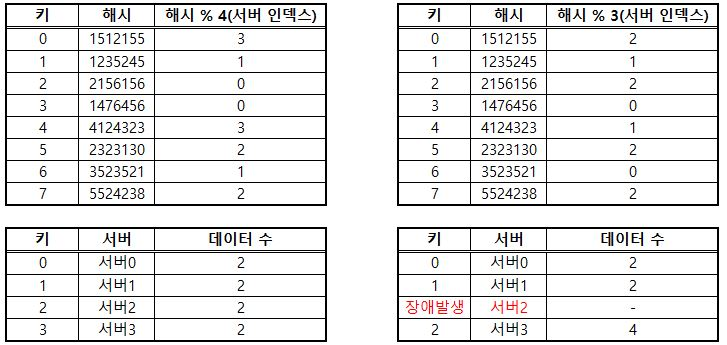
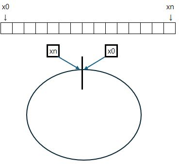
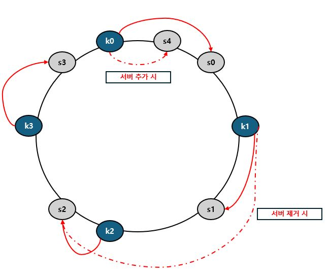

# 5장. 안정 해시 설계

## 핵심요약
- 

> 수평적 규모 확장성을 달성하기 위해서는 요청 또는 데이터를 서버에 균등하게 나누는 것이 중요하다.

## (1) 해시 키 재배치 문제

N개의 캐시 서버가 있다고 가정할 때 이 서버들에 부하를 균등하게 나누는 보편적 방법은
아래의 함수를 사용하는 것이다.
>serverIndex = hash(key) % N (N은 서버의 개수)

위 방법은 아래 두가지의 경우 정상 작동한다.
- 서버 풀의 크기가 고정되어 있을 때
- 데이터의 분포가 균등할 때

그러나 서버가 추가디거나 기존 서버가 삭제 되면 문제가 발생한다.

위 표와 같이 기존 2개씩 분배된 데이터가 1개의 서버가 장애를 발생하게 되면
장애가 발생한 서버 외에도 대부분의 키가 재배치되고 불균형하게 분포하게된다.

## (2) 안정 해시

> 해시 테이블 크기가 조정될 때 평균적으로 오직 k/n개의 키만 재배치하는 해시 기술

> 단점 :
>   -&nbsp; 파티션의 크기와, 키의 균등 분포를 달성하기 어렵다.

## 해시 공간과 해시 링 

- 해시 함수의 출력값이 0x ~ xn
- 위 함수의 해시 공간은 아래 막대 그림
- 해당 해시 공간을 구부려 접으면 해시 링이 만들어진다.

- 해시 서버의 추가 및 제거

> 그림과 같이 서버 수의 변동이 생겨도 일부 키만 재배치하게 된다.

 

