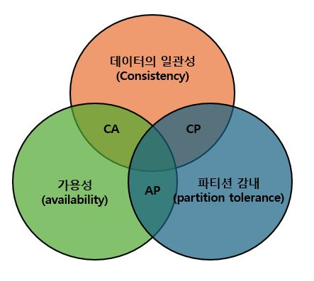

# 6장. 키-값 저장소 설계

## 핵심요약
- 

> - 키-값 저장소는 키-값 데이터베이스라고도 불리는 비 관계형 데이터베이스이다. 
> - 이 저장소에 젖아되는 값은 고유 식별자(identifier)를 키로 가져야 한다. 
> - 키와 값 사이의 이런 연결 관계를 "키-값" 쌍(pair)이라고 한다.
> - 키-값 쌍에서 값은 문자열, 리스트, 객체등 일 수 있다.

## (1) 문제 이해 및 설계 범위 확정

- 키-값 쌍의 크기는 10KB 이하
- 큰 데이터 저장 가능해야함
- 높은 가용성을 제공, 시스템에 장애가 있더라도 빠른응답 필요
- 높은 규모 확장성, 트래픽 양에 따라 자동적으로 서버 증설/삭제 필요
- 데이터 일관성 수준은 조정 가능해야함
- 응답 지연시간이 짧아야 함

## (2) 단일 서버 키-값 저장소

> 한대 서버만 사용하는 키-값 저장소 설계는 키-값 쌍 전부를 메모리에 해시 테이블로 저정하는 것이다. 
> 그러나 모든 데이터를 메모리에 저장하는 것은 불가능 할 수도 있다. 
> 개선책으론 아래 두가지를 고려할 수 있다.

- 데이터 압축(compression)
- 자주 쓰이는 데이터만 메모리에 두고 나머지는 디스크에 저장

## (3) 분산 키-값 저장소

> 키-값 쌍을 여러 서버에 분산시키기는 방법으로, 분산 해시 테이블이라고도 불린다. 
> 분산 시스템을 설계할 때는 CAP 정리(Consistency, Availability, Partition Tolerance theorem)를 이해하고 있어야 한다.

- 일관성(Consitency) : 분산 시스템에 접속하는 모든 클라이언트는 어떤 노드에 접속했느냐에 관계없이 언제나 같은 데이터를 보게 되어야 한다.
- 가용성(Availability) : 분산 시스템에 접속하는 클라이언트는 모두 일부 노드에 장애가 발생하더라도 항상 응답을 받을 수 있어야한다.
- 파티션 감내(Partition Tolerance theorem) : 파티션은 두 노드 사이에 통신 장애가 발생하였음을 의마한다. 파티션 감내는 네트워크에 파티션이 생기더라도 시스템은 계속 동작하여 한다는 것을 뜻한다.

> 키-값 저장소는 앞서 제시한 세 가지 요구사항 가운데 어느 두가지를 만족하느냐에 따라 다음과 같이 분류된다.

- CP 시스템 : 일관성과 파티션 감내를 지원, 가용성 희생
- AP 시스템 : 가용성과 파티션 감내를 지원, 데이터 일관성 희생
- CA 시스템 : 일관성과 가용성을 지원, 파티션 감내 희생, 그러나 통상 네트워크 장애는 피할 수 없는 일로 여겨지므로 분산 시스템은 반드시 파티션 문제를 감내할 수 있도록 설계되어야 한다. 그러므로 실세계에 CA시스템은 존재하지 않는다.

## (4) 시스템 컴포넌트

1. 데이터 파티션

여기에 항목1의 내용을 작성합니다.

2. 데이터 다중화

여기에 항목1의 내용을 작성합니다.

3. 일관성

여기에 항목1의 내용을 작성합니다.

4. 일관성 불일치 해소

여기에 항목1의 내용을 작성합니다.

5. 장애 처리

여기에 항목1의 내용을 작성합니다.

6. 시스템 아키텍쳐 다이어그램

여기에 항목1의 내용을 작성합니다.

7. 쓰기 경로

여기에 항목1의 내용을 작성합니다.

8. 읽기 경로

여기에 항목1의 내용을 작성합니다.

