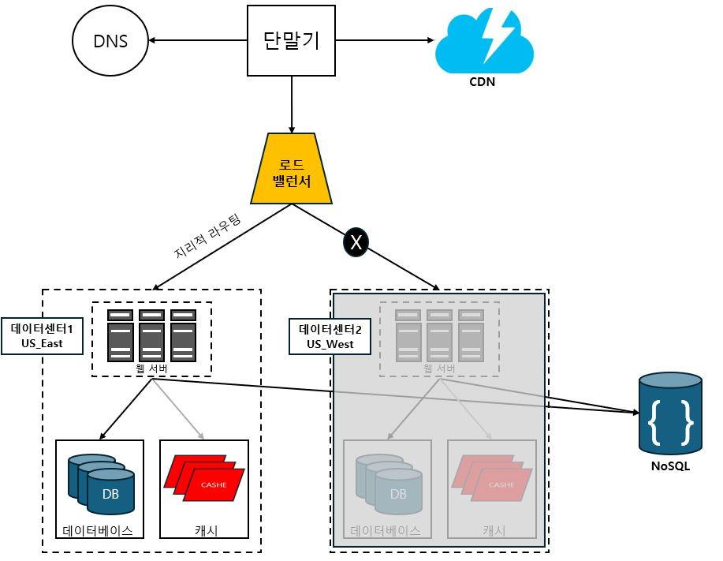

# 1장. 사용자 수에 따른 규모 확장성

## (8) 데이터 센터

> 가장 가까운 데이터 센터로 안내되는 지리적 라우팅(geoDNS-routing 또는 geo-routing)
>  ※ x%의 사용자는 US-East로 (100-x)%는 US-West로 안내된다고 가정

- 위와같은 아키텍처를 만들려면 해결해야할 사항
  - 트래픽 우회 : GeoDNS는 사용자에게서 가장 가까운 데이터센터로 트래픽을 보낼 수 있도록 해준다.
  - 데이터 동기화(synchronization) : 데이터 센터마다 별도의 데이터베이스를 사용하고 있는 상황이라면, 장애가 자동으로 복구되어(failover) 트래픽이 다른 데이터베이스로 우회된다 해도, 해당 데이터센터에는 찾는 데이터가 없을 수 있다.
      → 보편적 전략은 데이터를 여러 데이터센터에 걸쳐 다중화 하는 것이다.
  - 테스트와 배포(deployment) : 여러 데이터 센터를 사용하도록 시스템이 구성된 상황이라면 웹 사이트 또는 애플리케이션을 여러 위치에서 테스트해보는 것이 중요하다.  자동화된 배포 도구는 모든 데이터 센터에 동일한 서비스가 설치되도록 하는 데 중요한 역할을 한다.