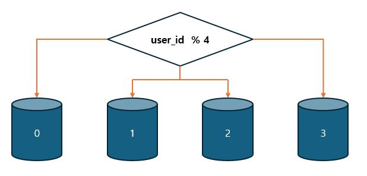

# 1장. 사용자 수에 따른 규모 확장성

## (11) 샤딩(sharding) - 데이터베이스의 수평적 확장

> 대규모 데이터베이스를 샤트라고 부르는 작은 단위로 분할하는 기술, 모든 샤드는 같은 스키마를 쓰지만 샤드에 보관되는 데이터 사이에 중복이 있어서는 안된다.

위 그림은 user_id % 4를 해시 함수로 사용하여 데이터가 보관되는 샤드를 정한다.

샤딩 전략을 구현할 때 고려해야 할 가장 중요한 것은 샤딩 키(sharding key)를 어떻게 정하느냐 하는 것이다.
파티션 키(partition key)라고도 부르는데, 데이터가 어떻게 분산될지 정하는 하나 이상의 칼럼으로 구성된다.

**※ 샤딩 키를 정할 때는 데이터를 고르게 분할 할 수 있도록 하는게 중요하다.**

- 샤딩 도입 시 해결해야할 문제
  - 데이터의 재 샤딩 → 안정 해시 기법 활용
    1. 재 샤딩은 데이터가 너무 많아져서 하나의 샤드로는 더 이상 감당하기 어려울 때
    2. 샤드 간 데이터 분포가 균등하지 못해 어떤 샤드에 할당된 공간 소모가 다른 샤드에 비해 빨리 진행될 때
  - 유명인사 문제 : 핫스팟 키 문제라고도 부르는데, 특정 샤드에 질의가 집중되어 서버에 과부하가 걸리는 문제
  - 조인과 비정규화 : 하나의 데이터베이스를 여러 샤드 서버로 쪼개고 나면, 여러 샤드에 걸친 데이터를 조인하기가 힘들어진다.