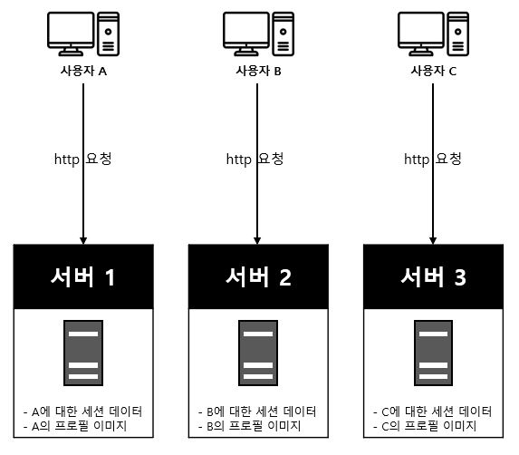
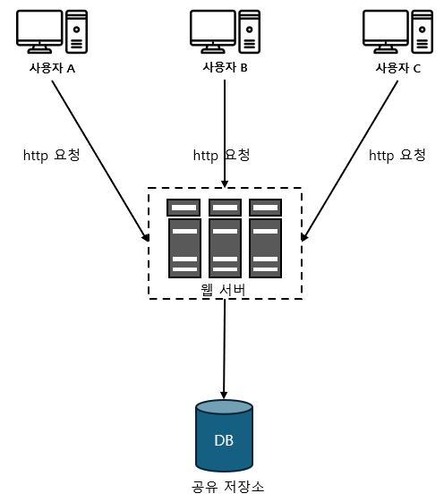

# 1장. 사용자 수에 따른 규모 확장성

## (7) 무상태(stateless) 웹 계층

- 상태 의존적인 아키텍쳐

  - 위 그림에서 사용자 A가 서버 2에 요청하게되면 인증이 실패하게된다.
  - 이를 해결하기 위해서는 로드밸런서에서 고정 세션이라는 기능을 사용해야하는데 이는 로드밸런서에 부담을 준다.
  - 장애 처리도 힘들고, 서버 확장도 어렵게된다.

- 무상태 아키텍쳐

  - 위 그림에서서 사용자로부터의 요청은 어떤 웹 서버로도 전달 될 수 있다.
  - 웹 서버는 상태 정보가 필요할 경우 공유 저장소로부터 데이터를 가져온다.
  - 이런 구조는 단순하고, 안정적이며, 규모 확장이 쉽다.