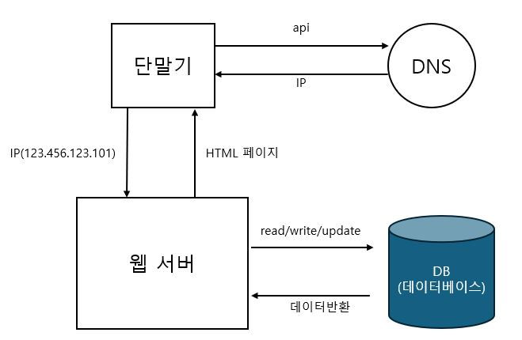
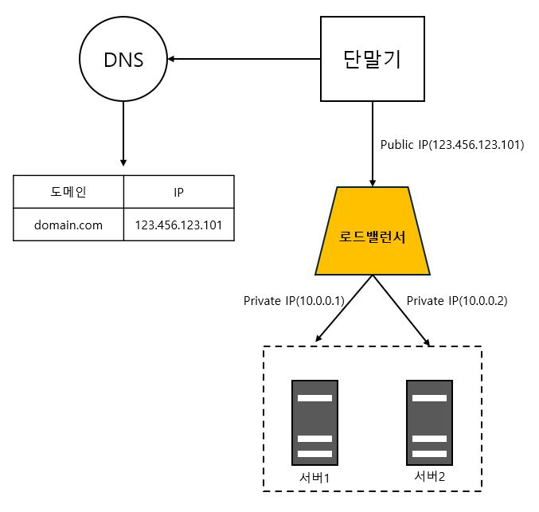
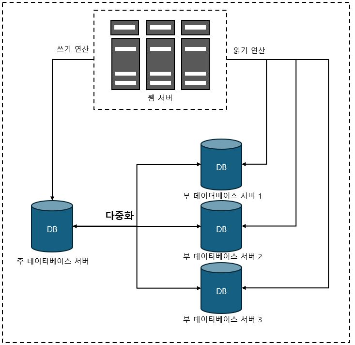

# 1장. 사용자 수에 따른 규모 확장성

## (2) 데이터베이스

- 사용자 증가 시 (1)의 과정에서 서버와 데이터베이스를 분리
- 하나는 트래픽을 처리
- 다른 하나는 데이터베이스용

**※ 위와같이 분리함으로써 독립적으로 확장 가능**

### 데이터베이스의 종류와 선택
- 관계형 데이터베이스(RDBMS) : 자료를 열, 칼럼으로 표현, SQL을 사용하면 여러 테이블에 있는 데이터를 그 관계에 따라 조인(join)하여 합칠 수 있다.
- 비 관계형 데이터베이스(NoSQL) : 조인 연산을 지원하지않음
  - 사용목적
    - 아주 낮은 응답 지연시간(latency)이 요구될 때
    - 다루는 데이터가 비정형(unstructured)이라 관계형 데이터가 아닐 때
    - 데이터(JSON, YAML, XML등)를 직렬화하거나(serialize) 역직렬화(deserialize) 할 수 있기만 하면 될 때
    - 아주 많은 양의 데이터를 저장할 필요가 있을 때
  - 분류
    - 키-값 저장소(key-value store)
    - 그래프 저장소(graph store)
    - 칼럼 저장소(column store)
    - 문서 저장소(document store)

## (3) 규모 확장
- 스케일 업(scale up)[수직적 규모 확장] : 서버에 고사양 자원(CPU, RAM등)을 추가, 업그레이드 하는 행위
  - CPU나 메모리를 무한대로 증설할 수 없다는 한계가 있다.
  - 장애에 대한 자동복구(failover) 방안이나 다중화(redundancy) 방안을 제시하지 않는다.
  - 서버에 장애가 발생하면 웹사이트/앱은 완전히 중단된다.
- 스케일 아웃(sacle out)[수평적 규모 확장] : 서버를 추가하는 방식
  - (1),(2)의 경우에서 웹서버가 다운되거나 많은 사용자가 몰리게되면 응답속도가 느려지거나 접속이 불가하게된다.
  - 이 문제를 해결하기 위해 부하 분산기 또는 로드밸런서(load balancer)를 도입한다.

1. 사용자는 공개 IP(Public IP)로 접속(웹 서버는 클라이언트의 접속을 직접 처리하지 않음)
2. 보안을 위해 서버간 통신에는 사설 IP 주소(Private IP Address)가 이용된다.
   - 사설 IP 주소는 같은 네트워크에 속한 서버 사이의 통신에만 쓰일 수 있는 IP 주소로 인터넷을 통해서 접속할 수 없다.
3. 그림과 같이 서버를 추가하게되면 장애를 자동복구하지 못하는 문제(no failover)는 해소되며, 웹 계층의 가용성(availability)은 향상된다.
   - 서버 1이 다운되면 모든 트래픽은 서버 2로 전송된다. 따라서 웹 사이트 전체가 다운되는 일이 방지된다.
   - 부하를 나누기 위해 서버를 추가 할 수도 있다.

## (4) 데이터베이스 다중화

> 많은 데이터베이스 관리 시스템이 다중화를 지원한다. 
> 보통은 서버사이에 주(master)-부(slave) 관계를 설정하고 데이터 원본은 주서버에, 사본은 부 서버에 저장하는 방식이다.

- 쓰기 연산(write operation)은 마스터에서만 지원한다.
- 부 부데이터베이스 주 데이터베이스로부터 그 사본을 전달받으며, 읽기 연산(read operation)만을 지원한다.

- 장점
  1. 성능향상 : 주-부 다중화 모델에서 모든 데이터 변경 연산은 주 데이터베이스 서버로만 전달되는 반면 읽기 연산은 부 데이터베이스 서버들로 분산되므로 병렬로 처리될 수 있는 query의 수가 늘어나므로 성능이 좋아진다. 
  2. 안정성 : 데이터베이스 서버 일부가 물리적으로 파괴되어도 데이터는 지역적으로 다중화시켜 놓았다면 데이터는 보존될 수 있다.
  3. 가용성 : 데이터베이스 서버가 장애가 발생하더라도 복제해 둠으로써 다른 서버에 있는 데이터를 가져와 계속 서비스할 수 있다.
0
**※ 주-부가 한대씩인 상황에서 주 데이터베이스 서버가 다운되면, 부 데이터베이스가 새로운 주 서버가 될 것이며, 모든 연산은 새로운 주 서버상에서 수행될 것이다.**