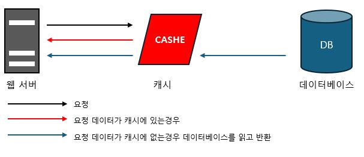

# 1장. 사용자 수에 따른 규모 확장성

## (5) 캐시

> 값비싼 연산 결과 또는 자주 참조되는 데이터를 메모리 안에 두고 빨리 처리될 수 있도록 하는 저장소이다.

 

> 어플리케이션의 성능은 데이터베이스를 얼마나 자주 호출하느냐에 크게 좌우되는데, 캐시는 그런 문제를 완화할 수 있다.

- 흐름
  1. 서버가 캐시에 데이터 유무를 확인
  2. 캐시에 데이터있으면 데이터베이스를 거치지않고 데이터를 반환
  3. 데이터가 없다면 데이터베이스에 접근하여 캐시에 씀
  4. 데이터베이스로부터 읽어온 데이터를 반환

- 사용 시 유의점
  - 갱신은 자주 일어나지 않지만 참조는 빈번하게 일어나는 경우
  - 캐시는 휘발성 메모리에 데이터를 저장하므로 영속적으로 보관할 데이터를 캐시에 두는것은 바람직하지 않다.
  - 원본 갱신과 캐시 갱신 연산이 단일 트랜잭션으로 처리되지 않는 경우 일관성이 깨질 수 있다.
  - 단일 장애 지점(Single Point of Failure, SPOF)이 될 수 있기에 캐시 서버를 여러 지역에 걸쳐 분산시켜야 한다.
  - 메모리가 너무 작으면 데이터가 자주 캐시에서 밀려나버려(eviction) 캐시의 성능이 떨어지게된다. 방법으로 과할당(overprovision)으로 방지 할 수 있다.
  - 데이터 방출(eviction) 정책 : 데이터가 꽉 차버리면 기존 데이터를 내보내야한다. 아래 정책 외에도 경우에 맞게 적용하면 된다.
    1. LRU(Least Recently Used) : 마지막으로 사용딘 시점이 가장 오래된 데이터를 내보내는 정책.
    2. LFU(Least Frequently Used) : 사용 빈도가 가장 낮은 데이터를 내보내는 정책.
    3. FIFO(First In First Out) : 가장 먼저 캐시에 들어온 데이터를 내보내는 정책.