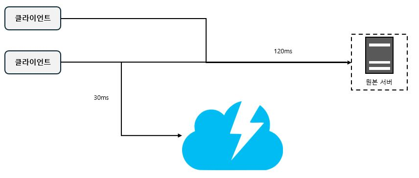
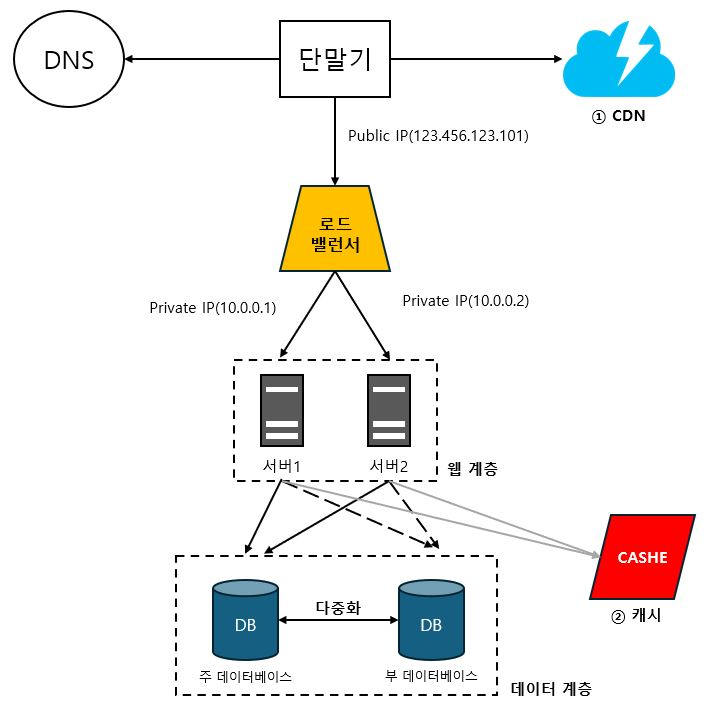

# 1장. 사용자 수에 따른 규모 확장성

## (6) 콘텐츠 전송 네트워크(CDN)
> 정적 콘텐츠를 전송하는 데 쓰이는, 지리적으로 분산된 서버의 네트워크

  

- 로딩시간 개선 예시

- 사용 시 고려해야 할 사항
  - 비용 : 보통 제3 사업자에 의해 운영되며, CDN에 들어가고 나가는 데이터 전송 양에 따라 과금이되므로 자주 사용되지 안흔 콘텐츠를 캐싱하는 것은 이득이 크지 않으므로 CDN에서 뺴는 것을 고려해야한다.
  - 만료 시한 설정 : 길면 콘텐츠의 신선도가 떨어질 것이고, 짧으면 원본 서버에 빈번히 접속하게 되므로 충분히 고려되야 한다.
  - 장애에 대한 대처 방안 : 가령 일시적으로 CDN이 장애가 발생할 경우 해당 문제를 감지하여 원본 서버로부터 직접 콘텐츠를 가져오도록 구성하는 것이 필요할 수 있다.
  - 콘텐츠 무효화(invalidation) 방법
    1. CDN 서비스 사업자가 제공하는 API를 이용하는 방법
    2. 콘텐츠의 다른 버전을 서비스하도록 오브젝트 버저닝이용, 콘텐츠의 새로운 버전을 지정하기 위해서는 URL 마지막에 버전 번호를 인자로 주면 된다 예를 들어inmage.png?v=2와 같은 식이다.

- CDN이 추가된 설계

- ① 정적 콘텐츠(JS, CSS, 이미지 등)는 더 이상 웹 서버를 통해 서비스하지 않으며, CND을 통해 제공하여 더 나은 성능을 보장한다.
- ② 캐시가 데이터베이스 부하를 줄여준다.