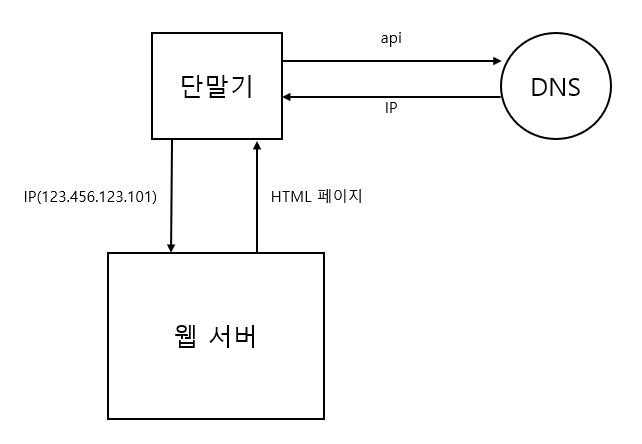
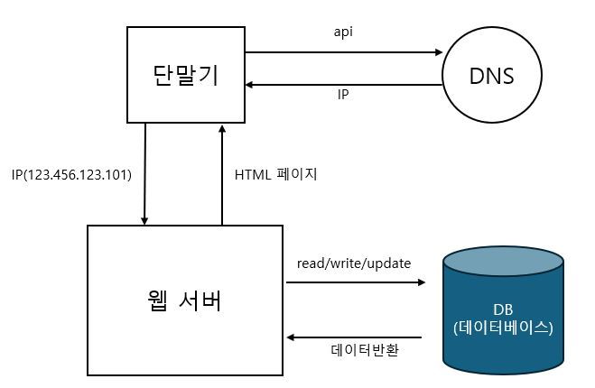
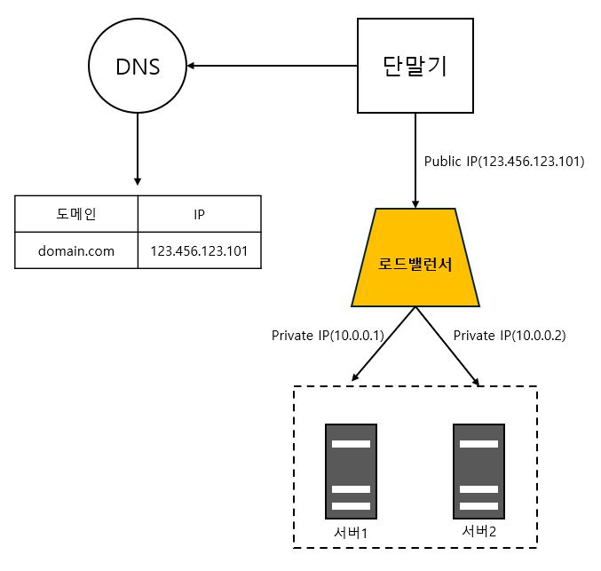
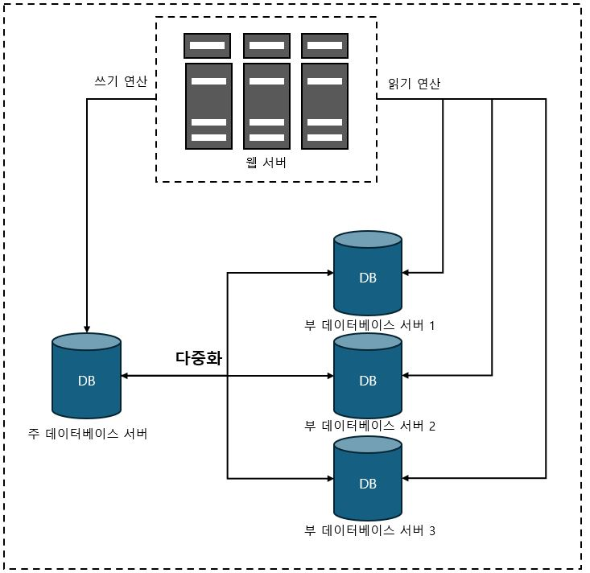
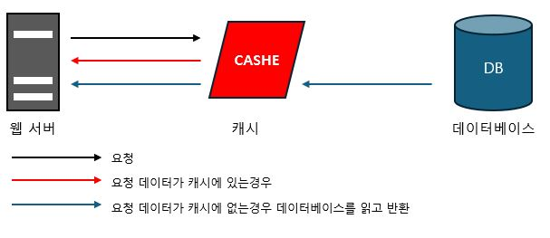
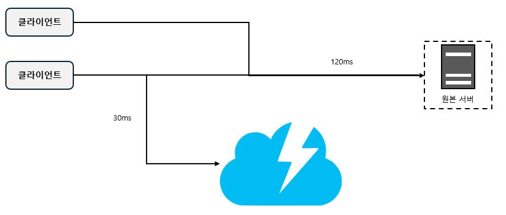
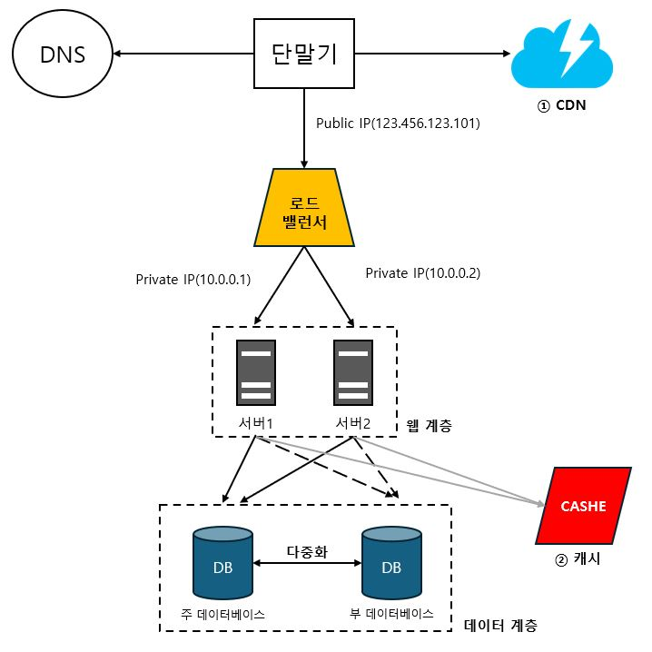
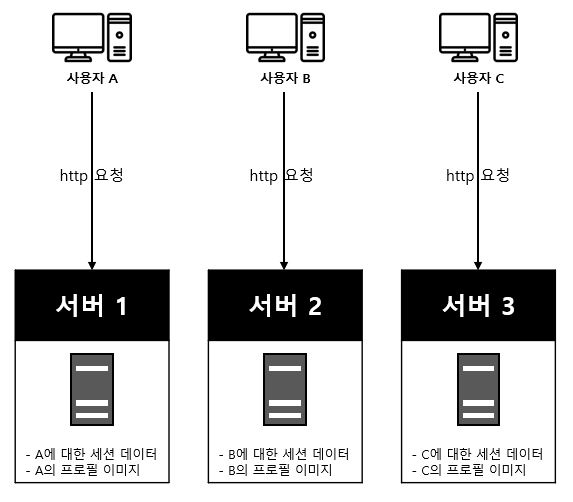
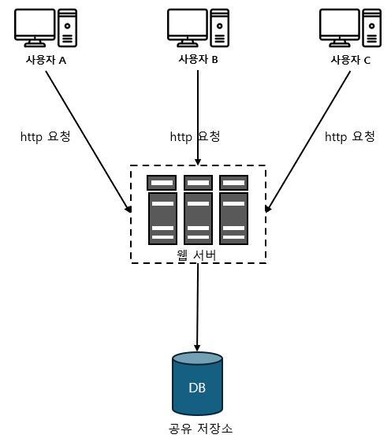

# 1장. 사용자 수에 따른 규모 확장성

## (1) 단일서버

1. 사용자가 도메인 이름을 이용하여 웹사이트에 접속
2. 접속을 위해서 DNS에 질의하여 IP주소로 변환하는 과정 필요(DNS는 보통 외부시스템)
3. 반환된 IP주소(123.456.123.101)으로 HTTP요청 전달
4. 요청받은 웹 서버는 HTML페이지나 JSON형태의 응답 반환

## (2) 데이터베이스

- 사용자 증가 시 (1)의 과정에서 서버와 데이터베이스를 분리
- 하나는 트래픽을 처리
- 다른 하나는 데이터베이스용

**※ 위와같이 분리함으로써 독립적으로 확장 가능**

### 데이터베이스의 종류와 선택
- 관계형 데이터베이스(RDBMS) : 자료를 열, 칼럼으로 표현, SQL을 사용하면 여러 테이블에 있는 데이터를 그 관계에 따라 조인(join)하여 합칠 수 있다.
- 비 관계형 데이터베이스(NoSQL) : 조인 연산을 지원하지않음
  - 사용목적
    - 아주 낮은 응답 지연시간(latency)이 요구될 때
    - 다루는 데이터가 비정형(unstructured)이라 관계형 데이터가 아닐 때
    - 데이터(JSON, YAML, XML등)를 직렬화하거나(serialize) 역직렬화(deserialize) 할 수 있기만 하면 될 때
    - 아주 많은 양의 데이터를 저장할 필요가 있을 때
  - 분류
    - 키-값 저장소(key-value store)
    - 그래프 저장소(graph store)
    - 칼럼 저장소(column store)
    - 문서 저장소(document store)

## (3) 규모 확장
- 스케일 업(scale up)[수직적 규모 확장] : 서버에 고사양 자원(CPU, RAM등)을 추가, 업그레이드 하는 행위
  - CPU나 메모리를 무한대로 증설할 수 없다는 한계가 있다.
  - 장애에 대한 자동복구(failover) 방안이나 다중화(redundancy) 방안을 제시하지 않는다.
  - 서버에 장애가 발생하면 웹사이트/앱은 완전히 중단된다.
- 스케일 아웃(sacle out)[수평적 규모 확장] : 서버를 추가하는 방식
  - (1),(2)의 경우에서 웹서버가 다운되거나 많은 사용자가 몰리게되면 응답속도가 느려지거나 접속이 불가하게된다.
  - 이 문제를 해결하기 위해 부하 분산기 또는 로드밸런서(load balancer)를 도입한다.

1. 사용자는 공개 IP(Public IP)로 접속(웹 서버는 클라이언트의 접속을 직접 처리하지 않음)
2. 보안을 위해 서버간 통신에는 사설 IP 주소(Private IP Address)가 이용된다.
   - 사설 IP 주소는 같은 네트워크에 속한 서버 사이의 통신에만 쓰일 수 있는 IP 주소로 인터넷을 통해서 접속할 수 없다.
3. 그림과 같이 서버를 추가하게되면 장애를 자동복구하지 못하는 문제(no failover)는 해소되며, 웹 계층의 가용성(availability)은 향상된다.
   - 서버 1이 다운되면 모든 트래픽은 서버 2로 전송된다. 따라서 웹 사이트 전체가 다운되는 일이 방지된다.
   - 부하를 나누기 위해 서버를 추가 할 수도 있다.

## (4) 데이터베이스 다중화

> 많은 데이터베이스 관리 시스템이 다중화를 지원한다. 
> 보통은 서버사이에 주(master)-부(slave) 관계를 설정하고 데이터 원본은 주서버에, 사본은 부 서버에 저장하는 방식이다.

- 쓰기 연산(write operation)은 마스터에서만 지원한다.
- 부 부데이터베이스 주 데이터베이스로부터 그 사본을 전달받으며, 읽기 연산(read operation)만을 지원한다.

- 장점
  1. 성능향상 : 주-부 다중화 모델에서 모든 데이터 변경 연산은 주 데이터베이스 서버로만 전달되는 반면 읽기 연산은 부 데이터베이스 서버들로 분산되므로 병렬로 처리될 수 있는 query의 수가 늘어나므로 성능이 좋아진다. 
  2. 안정성 : 데이터베이스 서버 일부가 물리적으로 파괴되어도 데이터는 지역적으로 다중화시켜 놓았다면 데이터는 보존될 수 있다.
  3. 가용성 : 데이터베이스 서버가 장애가 발생하더라도 복제해 둠으로써 다른 서버에 있는 데이터를 가져와 계속 서비스할 수 있다.
0
**※ 주-부가 한대씩인 상황에서 주 데이터베이스 서버가 다운되면, 부 데이터베이스가 새로운 주 서버가 될 것이며, 모든 연산은 새로운 주 서버상에서 수행될 것이다.**

## (5) 캐시

> 값비싼 연산 결과 또는 자주 참조되는 데이터를 메모리 안에 두고 빨리 처리될 수 있도록 하는 저장소이다.

 

> 어플리케이션의 성능은 데이터베이스를 얼마나 자주 호출하느냐에 크게 좌우되는데, 캐시는 그런 문제를 완화할 수 있다.

- 흐름
  1. 서버가 캐시에 데이터 유무를 확인
  2. 캐시에 데이터있으면 데이터베이스를 거치지않고 데이터를 반환
  3. 데이터가 없다면 데이터베이스에 접근하여 캐시에 씀
  4. 데이터베이스로부터 읽어온 데이터를 반환

- 사용 시 유의점
  - 갱신은 자주 일어나지 않지만 참조는 빈번하게 일어나는 경우
  - 캐시는 휘발성 메모리에 데이터를 저장하므로 영속적으로 보관할 데이터를 캐시에 두는것은 바람직하지 않다.
  - 원본 갱신과 캐시 갱신 연산이 단일 트랜잭션으로 처리되지 않는 경우 일관성이 깨질 수 있다.
  - 단일 장애 지점(Single Point of Failure, SPOF)이 될 수 있기에 캐시 서버를 여러 지역에 걸쳐 분산시켜야 한다.
  - 메모리가 너무 작으면 데이터가 자주 캐시에서 밀려나버려(eviction) 캐시의 성능이 떨어지게된다. 방법으로 과할당(overprovision)으로 방지 할 수 있다.
  - 데이터 방출(eviction) 정책 : 데이터가 꽉 차버리면 기존 데이터를 내보내야한다. 아래 정책 외에도 경우에 맞게 적용하면 된다.
    1. LRU(Least Recently Used) : 마지막으로 사용딘 시점이 가장 오래된 데이터를 내보내는 정책.
    2. LFU(Least Frequently Used) : 사용 빈도가 가장 낮은 데이터를 내보내는 정책.
    3. FIFO(First In First Out) : 가장 먼저 캐시에 들어온 데이터를 내보내는 정책.

## (6) 콘텐츠 전송 네트워크(CDN)
> 정적 콘텐츠를 전송하는 데 쓰이는, 지리적으로 분산된 서버의 네트워크

  

- 로딩시간 개선 예시

- 사용 시 고려해야 할 사항
  - 비용 : 보통 제3 사업자에 의해 운영되며, CDN에 들어가고 나가는 데이터 전송 양에 따라 과금이되므로 자주 사용되지 안흔 콘텐츠를 캐싱하는 것은 이득이 크지 않으므로 CDN에서 뺴는 것을 고려해야한다.
  - 만료 시한 설정 : 길면 콘텐츠의 신선도가 떨어질 것이고, 짧으면 원본 서버에 빈번히 접속하게 되므로 충분히 고려되야 한다.
  - 장애에 대한 대처 방안 : 가령 일시적으로 CDN이 장애가 발생할 경우 해당 문제를 감지하여 원본 서버로부터 직접 콘텐츠를 가져오도록 구성하는 것이 필요할 수 있다.
  - 콘텐츠 무효화(invalidation) 방법
    1. CDN 서비스 사업자가 제공하는 API를 이용하는 방법
    2. 콘텐츠의 다른 버전을 서비스하도록 오브젝트 버저닝이용, 콘텐츠의 새로운 버전을 지정하기 위해서는 URL 마지막에 버전 번호를 인자로 주면 된다 예를 들어inmage.png?v=2와 같은 식이다.

- CDN이 추가된 설계

- ① 정적 콘텐츠(JS, CSS, 이미지 등)는 더 이상 웹 서버를 통해 서비스하지 않으며, CND을 통해 제공하여 더 나은 성능을 보장한다.
- ② 캐시가 데이터베이스 부하를 줄여준다.

## (7) 무상태(stateless) 웹 계층

- 상태 의존적인 아키텍쳐

  - 위 그림에서 사용자 A가 서버 2에 요청하게되면 인증이 실패하게된다.
  - 이를 해결하기 위해서는 로드밸런서에서 고정 세션이라는 기능을 사용해야하는데 이는 로드밸런서에 부담을 준다.
  - 장애 처리도 힘들고, 서버 확장도 어렵게된다.

- 무상태 아키텍쳐

  - 위 그림에서서 사용자로부터의 요청은 어떤 웹 서버로도 전달 될 수 있다.
  - 웹 서버는 상태 정보가 필요할 경우 공유 저장소로부터 데이터를 가져온다.
  - 이런 구조는 단순하고, 안정적이며, 규모 확장이 쉽다.